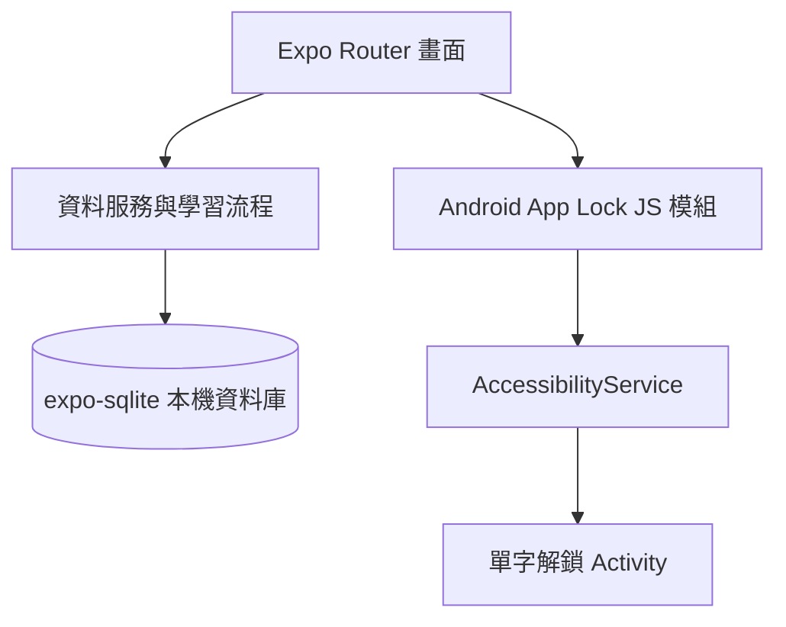

# 詞伴 App 架構與功能

## App 定位

離線英文單字學習工具。使用者建立單字本、加入英文字詞和中文釋義，然後透過翻卡、選擇題、拼字題及混合測驗記憶單字。Android 另有可選的 App Lock：開啟受限 App 時先回答一張單字卡。

## 使用者功能

| 區域 | 功能 |
| --- | --- |
| 單字本 | 建立、搜尋、開啟及刪除單字本；查看詞卡數 |
| 詞卡 | 新增、編輯、刪除、搜尋、收藏；欄位包含單字、音標、中文釋義、例句 |
| 複習 | 翻面看釋義和例句；標記「再複習」或「已熟悉」 |
| 測驗 | 中文選擇、英文拼字、兩種題型交錯；逐題回饋並記錄正確率 |
| 學習總覽 | 詞卡／單字本總數、今日複習數、本週複習量、答題正確率、熟悉單字數 |
| App Lock | Android 無障礙服務可監看指定 App，顯示單字問題；答對後按設定暫時解除 |

## 程式分層



| 路徑 | 職責 |
| --- | --- |
| `src/app/_layout.tsx` | Expo Router 根 Stack 與資料庫啟動 |
| `src/app/(tabs)/` | 單字本、學習總覽、設定三個主頁籤 |
| `src/app/deck/[id].tsx` | 單字本明細與詞卡管理 |
| `src/app/study/[deckId].tsx` | 翻卡、選擇、拼字、混合複習工作階段 |
| `src/components/ui.tsx` | 共用色彩、按鈕、表單欄位、資訊卡與空狀態 |
| `src/db/schema.ts` | SQLite 連線、向後相容的資料表初始化與設定儲存 |
| `src/db/queries.ts` | 單字本、詞卡、學習紀錄及統計查詢 |
| `modules/vocab-app-lock/` | Expo 原生模組與 Android 無障礙解鎖流程 |
| `android/` | Android Gradle 專案、App Manifest、簽署與建置設定 |

## 本機資料

資料庫檔案為 `vocab.db`，既有資料表會保留，不需清除 App 資料：

- `decks`：單字本名稱、說明和建立時間。
- `cards`：單字、音標、釋義、例句、收藏狀態及熟悉度。
- `study_attempts`：題型、答對狀態及作答時間。
- `app_settings`：App Lock 選項等本機設定。

刪除單字本或詞卡時，同一資料庫中的關聯學習紀錄會一併刪除。資料只存於本機，沒有帳號或雲端同步。

## 技術組成

- Expo SDK 57、React Native 0.86、React 19、TypeScript。
- Expo Router 檔案式導覽。
- `expo-sqlite` 儲存本機單字與學習紀錄。
- Android App Lock 使用本機 Expo Module、`AccessibilityService` 和原生 Activity；iOS、Web 不提供此功能。
- `app.json` 保留 Android application ID `com.anonymous.myapp`，避免覆蓋已安裝 App 的識別。

## 開發與打包

在 Windows PowerShell 專案根目錄執行：

```powershell
npm ci
.\scripts\build-android.ps1
```

React Native Android 建置使用 JDK 17；可用 `choco install -y microsoft-openjdk17` 安裝。打包腳本會優先使用專案內的 JDK 17，否則檢查 `JAVA_HOME` 或系統 Java 版本。Expo SDK 57 也需要 Node.js 22.13 或更新版本。

Release APK 預設輸出到 `android/app/build/outputs/apk/release/app-release.apk`。若要 Debug APK，執行 `.\scripts\build-android.ps1 -Variant debug`。目前 Android release 設定仍以 debug.keystore 簽署，因此產物適合安裝測試；正式上架前要改用正式簽署憑證。

若本機 Gradle 下載 Maven 檔案出現 `bad_record_mac`，可改用 Expo EAS 雲端 Android Build；這不需要重寫 App，但 Android 原生模組必須一同提交／上傳，且需要 Expo 帳號及網路連線。

已預先設定 `eas.json` 的 `preview` 設定輸出可直接安裝的 APK。登入 Expo 帳號並連結專案後，使用 `eas build --platform android --profile preview`。雲端建置會把專案送到 Expo Build 服務；第一次使用需要登入及連結 EAS 專案。
